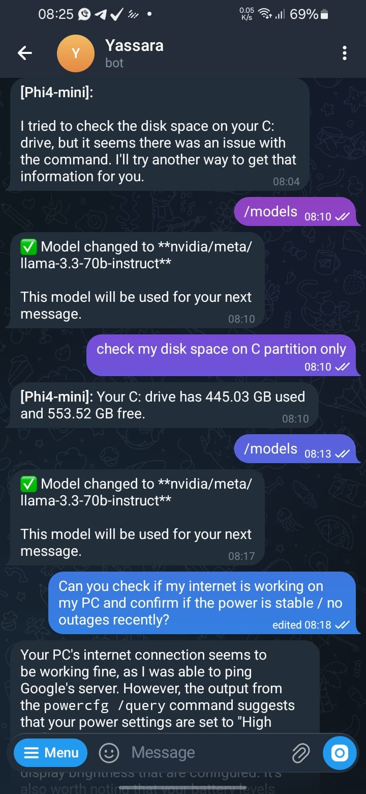

# FUSE AI 🤖 (FUll SEtup AI Agents)


[](http://makeapullrequest.com)

Practical setup guides, reusable templates, and sync workflows for running local AI coding agents with Ollama and any other compatible tools.

<p align="center">
  
  <br />
  <em>OpenClaw personal AI assistant running via Telegram both local and cloud model</em>
</p>

This repository documents a real developer stack built around:
- **Aider** — primary Windows-native repo editing agent
- **OpenClaw** — personal AI assistant via Telegram with multi-agent and tool calling (replaced Hermes)
- **Pi** — lean customizable coding harness
- **Ollama** — local model runtime (9 models, auto-swap fallback chain)
- **Continue.dev** — editor integration and autocomplete
- **OpenCode** — hosted coding workflow option

It is built for people who want a real local workflow for create, read, update, and delete tasks on actual project files, not just chat demos.

## Why This Repository Exists

Most AI-agent setup notes are either:
- too generic to reproduce
- too personal to reuse
- too fragile to maintain

This repository tries to be more useful:
- real-world setup patterns
- model-role mapping that matches actual hardware limits
- public-safe templates
- sync workflows for keeping docs aligned with a tested local setup
- a contribution-friendly structure for people who want to share their own setups

## Who This Repository Is For

- Fullstack developers
- IT generalists
- Local-first AI users
- Windows users with low-VRAM GPUs
- People who want to back up and version their agent configuration cleanly

## Supported Agents

| Agent | Runtime | Default Model | Best Use |
|---|---|---|---|
| Aider | Windows native | Jan-code | Primary repo editing, file CRUD |
| OpenClaw | Windows native (Node.js) | Phi4-mini | Personal AI assistant via Telegram, tool calling, multi-agent |
| Pi | Windows native | Jan-code | Lean customizable coding harness |

OpenClaw replaced Hermes Agent (WSL-based). No WSL dependency required anymore.

## Related Tooling Ecosystem

These are not all configured as primary agents in the same way, but they are part of the practical tool ecosystem around this setup:

| Tool | Role |
|---|---|
| Ollama | local model runtime |
| OpenCode | hosted coding workflow option |
| Continue.dev | editor integration, autocomplete, and inline assistance |
| CodeGemma | autocomplete-oriented local model |
| Zed IDE | modern editor worth testing for AI-native workflows |

## Useful External Resources

- `https://context7.com` -> useful for fetching fresher framework and library documentation context
- `https://opencode.ai` or your OpenCode access path -> strong hosted coding workflow option, often good for free-tier experimentation depending on account access
- `https://build.nvidia.com` -> worth testing for free hosted model access and experimentation
- `https://zed.dev` -> Zed IDE is worth trying if you want another AI-friendly editor workflow
- [Another free LLM API's list](https://github.com/mnfst/awesome-free-llm-apis)
- [Awesome MCP Servers](https://github.com/punkpeye/awesome-mcp-servers) — curated list of MCP servers for extending tool capabilities

## Supported Environments

- `local-gpu-4gb` - fully documented from a real working setup
- `local-cpu-only` - recommended setup path using NovaforgeAI models

## Current Local GPU 4GB Model Strategy

### Local Models (Ollama)

| Model | Size | Role | Tool Calling |
|---|---|---|---|
| `phi4-mini:3.8b-q4_K_M` | 2.5 GB | **OpenClaw primary** — tool calling + step-by-step reasoning | Yes |
| `fredrezones55/Jan-code:Q4_K_M` | 2.7 GB | **Aider/Pi default** — balanced daily coding | No |
| `aikid123/Qwen3-coder:latest` | 1.4 GB | Fast code and chat with thinking | No |
| `fredrezones55/qwen3.5-opus:4b` | 3.4 GB | Complex reasoning and heavier work | No |
| `softw8/Nanbeige4.1-3B-q4_K_M` | 2.5 GB | Backup tool calling | Yes |
| `relational/orlex:latest` | 3.3 GB | Backup reasoning and planning | No |
| `rardiolata/CodeTito:latest` | 2.0 GB | Backup coding | No |
| `codegemma:2b` | 1.6 GB | Autocomplete (editor integration) | No |
| `nomic-embed-text:latest` | 274 MB | Embeddings only, not for chat/coding | No |

### Cloud Fallbacks (Optional, Last Resort)

| Provider | Model | Purpose |
|---|---|---|
| Google | Gemini 2.5 Flash (free tier) | Long context (1M tokens), tool calling |
| NVIDIA | Llama 3.3 70B (free tier) | High-quality fallback |

Cloud models are only used when all local models fail. See [OpenClaw Model Guide](guides/OPENCLAW_MODEL_GUIDE.md) for the full fallback chain.

### OpenClaw Auto-Swap Fallback Chain

```
Phi4-mini → Qwen3-coder → Jan-code → Qwen3.5-opus → Orlex → CodeTito → Nanbeige → Gemini Flash → NVIDIA Llama
(local)     (local)        (local)    (local)         (local)  (local)    (local)     (cloud free)   (cloud free)
```

## Environment Comparison

| Environment | Status | Best Default | Notes |
|---|---|---|---|
| Local GPU 4GB | Tested | `phi4-mini:3.8b-q4_K_M` (OpenClaw) / `Jan-code` (Aider) | Multi-model role split with auto-swap fallback chain |
| Local CPU Only | Recommended | NovaforgeAI small models or API-backed providers | Good contribution target for future validation |

## Cost-Saving Strategies: Hybrid Workflow with Local + API Models

While there are technically ways to exploit models and quotas using OpenCode, sorry i will not discuss those here but i will share some of the best strategies for maximizing output while minimizing API token costs, which is a critical part of running AI agents in a sustainable way.

InshaAllah, with this blessed approach, the savings achieved will be more meaningful and sustainable. 🙏

> *"Halal sustenance brings long-term blessings."*

One of the most powerful patterns is combining local models for execution with premium API models (Claude Opus, Gemini Pro, GPT-4+) for architecture and complex reasoning. This dramatically reduces API token costs while maintaining high-quality output.

Also you can use Claude Code as an agent with free-tier API keys from OpenRouter (e.g., qwen3 models) instead of paid Claude API. See [Claude Code + OpenRouter Integration Guide](https://openrouter.ai/docs/guides/coding-agents/claude-code-integration) for setup instructions.

## ⚠️ AI Cost Warning

> **Recommendation:** Use **Claude Pro ($20/month)** with the official
> [Claude Code](https://claude.ai/code) extension rather than
> OpenRouter pay-as-you-go API.
>
> In agentic mode (Zed, Claude Code), a single prompt can
> trigger **20–50+ API calls automatically** — each with full context.
> Real (in my) case: **$11.65 spent in one day** from just a 2 prompts
> using Claude Opus via OpenRouter.
>
> If you must use an API, always set a **spending limit** on your
> platform if available and use
> cheaper models (Sonnet / Qwen free) for execution tasks.
> OpenRouter's also offers Enable 1% discount on all LLMs
> Consent to OpenRouter using your inputs/outputs to improve the product.

### Recommended Execution Models

For actual code implementation, these local models provide excellent cost savings:

**Fast Execution (Recommended):**
- `qwen2.5-coder:3b` - Fast and capable, works best when tasks are broken into multiple focused plan files rather than one long context

**Better Quality:**
- `deepseek-coder:6.7b-instruct-q4_0` - Higher quality output, slightly slower but more reliable for complex tasks

### Strategy 1: Architect & Builder Workflow

Don't waste expensive API tokens on boilerplate code. Use premium models purely for high-level design.

**Step 1: The Architect (Claude Opus / Gemini Pro)**

Prompt the premium model with this instruction:

```
Act as an Expert Software Architect and Principal Engineer. Your task is to design a comprehensive Technical Specification Document for the feature/system requested below.

CRITICAL INSTRUCTION TO SAVE TOKENS:
DO NOT write the actual implementation code. DO NOT write full functions. Your output must ONLY contain high-level architecture, logic flows, file structures, and strict pseudocode.

Please provide the output in clean Markdown format with the following sections:
1. System Overview: A brief summary of how the solution works.
2. File Structure: A tree representation of the files to be created or modified.
3. Tech Stack & Dependencies: Any specific libraries, modules, or APIs needed.
4. Data Flow / State Management: How data moves between components.
5. Step-by-Step Logic (Pseudocode): The exact logical steps for core algorithms, edge cases, and security considerations.
6. Execution Order: A numbered list of which file/component should be built first.

Here is the feature I want to build:
[DESCRIBE YOUR FEATURE HERE]
```

**Step 2: The Builder (Gemini Flash / Minimax 2.5 / Local Model)**

Take the Technical Spec from Claude and feed it to a cheaper/free executor:

```
Act as a Senior Full-Stack Developer. I will provide you with a Technical Specification Document written by an Expert Architect.

Your task is to write the COMPLETE, production-ready, and fully functional code based EXACTLY on this specification.

Rules:
1. Follow the file structure and execution order provided.
2. Write clean, well-commented code.
3. Do not skip any logic mentioned in the pseudocode.
4. Output the code block by block, clearly stating the filename above each code block.

Here is the Technical Specification:
[PASTE CLAUDE'S SPEC HERE]
```

Use:
- **Gemini 3 Flash** - Blazing fast, huge context window, very cheap for mass execution
- **Local qwen2.5-coder:3b** - Free, fast, works great with focused specs
- **Local deepseek-coder:6.7b** - Free, better quality for complex implementations

### Strategy 2: Output Diffs Only (Anti-Rewrite)

One of the biggest token drains is when AI rewrites 500 lines when you only asked to change 3 lines.

**Always end your prompts with:**

```
Only provide the code that changed, with comments indicating where to insert it.
NEVER rewrite entire files that haven't changed.
```

### Strategy 3: Provide a "Map", Not the "Territory" (Skeletal Context)

When debugging large projects, don't paste entire files into chat.

**Solution:**
1. Generate a directory tree structure (use `tree` command or OpenCode)
2. Provide the "Directory Map" to the AI
3. Let the AI determine which files it actually needs to see
4. Only then provide the specific file contents

### Strategy 4: Offload Trivial Tasks to Local Models

If we use Ollama and VSCodium (Continue.dev/OpenCode), use them as your first line of defense:

**Autocomplete (0 tokens):**
- Let `qwen2.5-coder:1.5b-base` handle line-by-line autocomplete as you type

**Small Refactoring (0 tokens):**
- Use local `deepseek-r1:1.5b` in OpenCode terminal for:
  - Regex generation
  - Code formatting
  - Simple unit tests
  - Variable renaming

**Only escalate to premium APIs (Claude Opus/Gemini Pro) when:**
- Hitting a dead end (complex Nginx config bugs, intricate state management)
- Architectural decisions needed
- Complex debugging requiring deep reasoning

### Cost Comparison Example

**Traditional approach (all premium API):**
- Architect + Implementation: ~50,000 tokens ($$$)

**Hybrid approach:**
- Architect (Claude Opus): ~5,000 tokens ($)
- Implementation (Gemini Flash or local): ~0-1,000 tokens (¢ or free)
- **Savings: ~90%**

GPT,Llama models also good in tool calling mode, so you can use them for tool orchestration,bash,deploy,etc while letting other models handle the actual code generation.

**For complete master prompts and detailed strategies, see:**
- [guides/COST_SAVING_PROMPTS.md](guides/COST_SAVING_PROMPTS.md) - Battle-tested prompts for Architect & Builder workflow, also use the magic of DCP plugins to manage your context and token usage in opencode, this is a quick summary of my patterns for maximizing output while minimizing tokens.

```
1. AGENTS.md → model fallback chain
2. DCP       → 20-40% saving ctx
3. Plan mode → focused & minimal iterations
4. Session/task → keep context clean
5. /dcp sweep {n} → prune irrelevant context
6. /compact       → aggressive compression
```

```
1. /dcp context  ← check current state
2. /dcp sweep 10 ← prune least relevant ctx
3. /dcp context  ← confirm pruning results
4. /compact      ← last resort
```

## Quick Start

- Read `docs/quick-start.md`
- For the tested setup, start with `docs/installation/local-gpu-4gb.md`
- For the lighter CPU-oriented path, read `docs/installation/local-cpu-only.md`

## Repository Structure

```text
docs/       -> setup guides, operations, troubleshooting, contribution notes
templates/  -> reusable public-safe config templates by environment
guides/     -> quick command references
scripts/    -> sync helpers and utilities (including Ollama auto-start fix)
assets/     -> screenshots and images
```

## Utilities

### Ollama Auto-Start Fix

Automated solution for Ollama startup issues after PC restart. Solves the common problem where Ollama processes hang and require manual restart after reboot.

**Location:** [`scripts/ollama/`](scripts/ollama/)

**Quick Setup:**
```bash
cscript scripts\ollama\setup-ollama-startup.vbs
```

**Features:**
- Automatic startup after PC restart
- Kills hung processes automatically
- 10-second delay for system stability
- Runs minimized in background
- No admin privileges required

**Documentation:**
- [Full Guide](scripts/ollama/README.md)
- [Quick Reference](scripts/ollama/QUICK-REFERENCE.md)

## Documentation Map

### Agents
- `docs/agents/openclaw-agent.md` - **OpenClaw setup, multi-agent, Telegram, skills, cloud fallback**
- `docs/agents/aider.md` - Aider configuration and usage
- `docs/agents/pi-agent.md` - Pi agent setup
- `docs/agents/continue-dev.md` - Continue.dev editor integration
- `docs/agents/opencode.md` - OpenCode hosted workflow

### Guides
- **`guides/OPENCLAW_MODEL_GUIDE.md`** - Model strategy, Phi4-mini, fallback chain, VRAM tuning
- **`guides/OPENCLAW_PERFORMANCE_GUIDE.md`** - 4GB VRAM optimization, timeouts, context window, disk management
- **`guides/AGENT_COMMANDS.md`** - All launcher commands for Aider, OpenClaw, Pi
- `guides/COST_SAVING_PROMPTS.md` - Architect & Builder workflow prompts

### Setup
- `docs/overview.md`
- `docs/quick-start.md`
- `docs/installation/local-gpu-4gb.md`
- `docs/installation/local-cpu-only.md`
- `docs/models/model-strategy.md`

### Operations
- `docs/operations/security.md` - Security model, pairing, data privacy
- `docs/operations/backup-and-restore.md`
- `docs/operations/update-workflow.md`
- `docs/operations/contributor-sync-guide.md`
- `docs/operations/troubleshooting.md`

### Utilities
- `scripts/ollama/README.md` - Ollama auto-start utilities

## Why Back Up Agent Configs at All?

If you use Aider, OpenClaw, Pi, Ollama, custom launchers, and local model routing, your setup becomes part of your engineering environment.

Backing it up gives you:
- a faster restore path on a new machine
- versioned changes to prompts, configs, and launchers
- cleaner experimentation with different models
- easier sharing of sanitized setups with other people

## Public Repo vs Private Repo

This project works best with two repositories:

- public repo -> reusable docs, templates, contributor-friendly structure
- private repo -> your live working backup and machine-specific copies

Recommended rule:
- private repo first
- public repo second

## Keeping the Repository in Sync With a Local Setup

This repository is designed to be updated from a real local working setup.

Recommended order:

1. update and validate the local machine setup
2. sync the private backup repository
3. refresh the public templates
4. update the docs if commands or model strategy changed

Useful scripts:

```powershell
# from the public repo
powershell -ExecutionPolicy Bypass -File .\scripts\sync-all.ps1

# or run the public step only
powershell -ExecutionPolicy Bypass -File .\scripts\refresh-public-templates.ps1
```

For more detail, read:

- `docs/operations/update-workflow.md`
- `docs/operations/contributor-sync-guide.md`

## Share Your Setup

This repository is intentionally structured so other people can contribute their own working AI-agent setups.

Useful contributions include:
- cloud VPS without GPU
- Linux desktop
- macOS
- larger local GPU setups
- better CPU-only model recommendations
- alternative local model families
- Continue.dev presets and editor configs
- OpenCode or Build NVIDIA hosted usage notes
- Zed IDE workflow notes
- different launcher strategies

If you maintain your own agent stack, consider contributing:
- sanitized config templates
- documented model choices
- launcher patterns
- hardware notes
- troubleshooting notes

The goal is simple: make it easier for other people to back up, understand, and share agent setups that actually work.

If your setup differs from this one, that is a feature, not a problem.
Different hardware tiers, operating systems, model families, and launcher strategies are all useful contributions when they are documented clearly.

## Contributing

Contributions are welcome.

See `docs/contribution-guide.md` for the preferred direction and `docs/operations/contributor-sync-guide.md` for the sync/update workflow.

Good contribution examples:
- a tested CPU-only setup with measured tradeoffs
- a Linux-native workflow
- a cloud VPS no-GPU workflow
- a cleaner launcher design
- better restore or troubleshooting notes

## Security Notes

- Do not commit real API keys, auth files, or session state
- Treat these templates as public-safe examples unless explicitly marked as private backup material
- Review all launcher scripts before running them on production machines

## License

MIT
